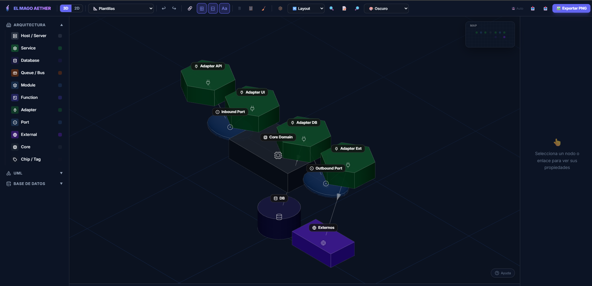
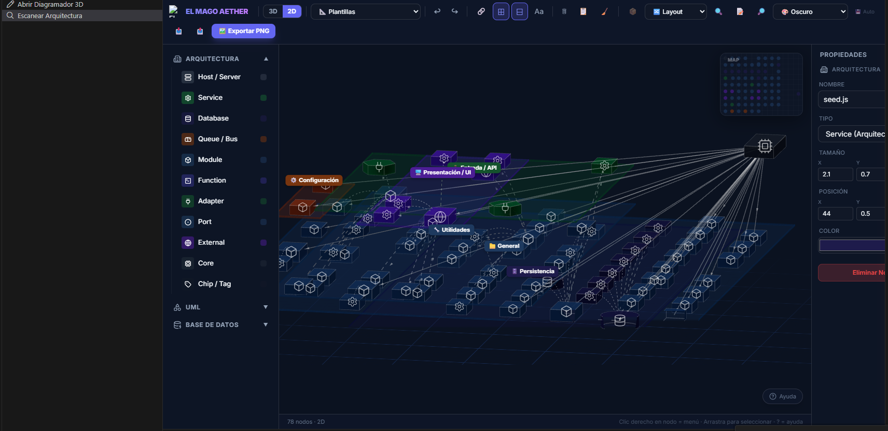

# Diagramador de Arquitectura 3D

  

**El Mago Aether** es un potente editor y generador de diagramas isométricos 3D diseñado específicamente para arquitectos de software, desarrolladores y diseñadores de sistemas. Te permite visualizar la arquitectura de tu proyecto en tres dimensiones, analizar dependencias y exportar diagramas hermosos directamente desde Visual Studio Code.

## ✨ Características Principales

  

- 🔍 **Escaneo Automático de Arquitectura**: Genera un diagrama 3D interactivo analizando tu código fuente (`src`, `app`, `server`, etc.). Detecta dependencias, agrupa módulos y filtra automáticamente archivos de configuración (tests, lints, locks) para mantener un modelo limpio.

- 🏗️ **Lienzo 3D Real**: Construye usando cilindros, cajas y modelos con renderizado físicamente realista (PBR), sombras e iluminación nativa impulsados por React Three Fiber.
- 🗺️ **Minimapa Interactivo**: Navega al instante por diagramas gigantes haciendo clic en el minimapa (esquina superior derecha).
- 🏷️ **Control de Ruido Visual**: Activa o desactiva las etiquetas de texto ("Aa") para apreciar mejor la estructura tridimensional pilar del sistema.
- 🔗 **Layouts Inteligentes**: Algoritmos de ordenamiento automático topológico (árbol) o de cuadrícula para organizar sistemas complejos con un clic.
- 🎨 **Temas Personalizados**: Interfaz adaptable a diferentes temas (Oscuro, Claro, Blueprint, Alto Contraste).
- 🖼️ **Exportación Nativa en VS Code**: Exporta los modelos topológicos y diagramas hermosos a **PNG** o **JSON** directamente en tu sistema de archivos mediante diálogos nativos de VS Code.

## 🚀 Uso

Existen dos formas principales de usar el Diagramador:

### Opción 1: Escaneo Automático (Recomendado)
1. Abre un proyecto en VS Code.
2. Abre la **Paleta de Comandos** (`Ctrl+Shift+P` o `Cmd+Shift+P` en Mac).
3. Busca y ejecuta: **`Aether: Escanear Arquitectura del Proyecto`**.
4. ¡El diagrama 3D con la arquitectura de tus carpetas y dependencias se generará mágicamente!

### Opción 2: Modo Manual
1. Haz clic en el ícono del **Diagramador 3D** en la Barra de Actividad lateral izquierda de VS Code.
2. Haz clic en el botón **Abrir Diagramador 3D**.
3. Arrastra bloques (Servidores, Bases de Datos, Módulos) desde la paleta izquierda hacia el lienzo 3D.
4. Conecta los nodos pulsando el botón de enlace (🔗) o desde el menú de clic derecho.

## 🕹️ Controles de Navegación 3D
- **Clic Izquierdo / Arrastrar**: Seleccionar y mover nodos, o usar la caja de selección múltiple en el fondo.
- **Clic Derecho / Arrastrar Fondo**: Rotar la cámara 3D.
- **Scroll (Rueda)**: Hacer zoom in/out.
- **Botón Central / Arrastrar**: Mover (Pan) la cámara por el plano.
- **Minimapa**: Haz clic en cualquier parte superior derecha para viajar a esa zona al instante.

---

**Disfruta diseñando y visualizando arquitectura del futuro.**
